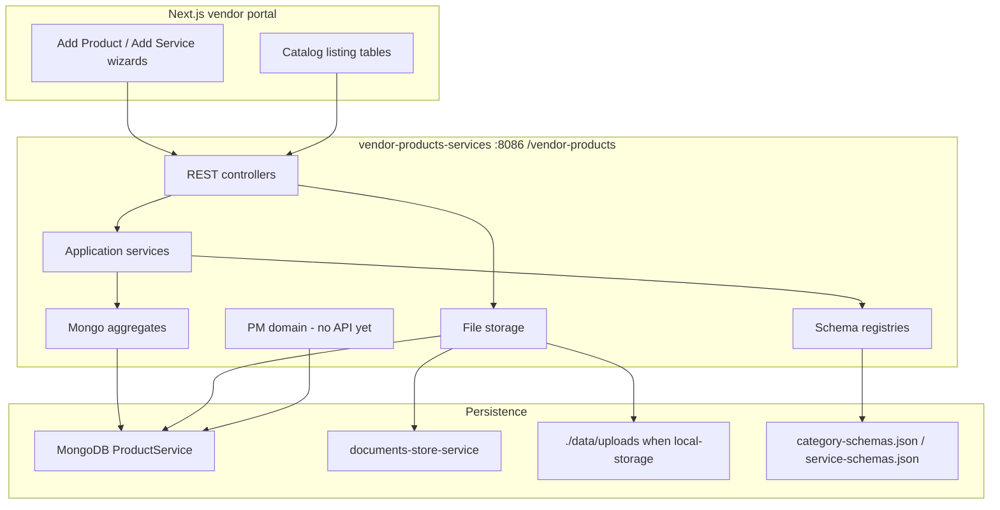
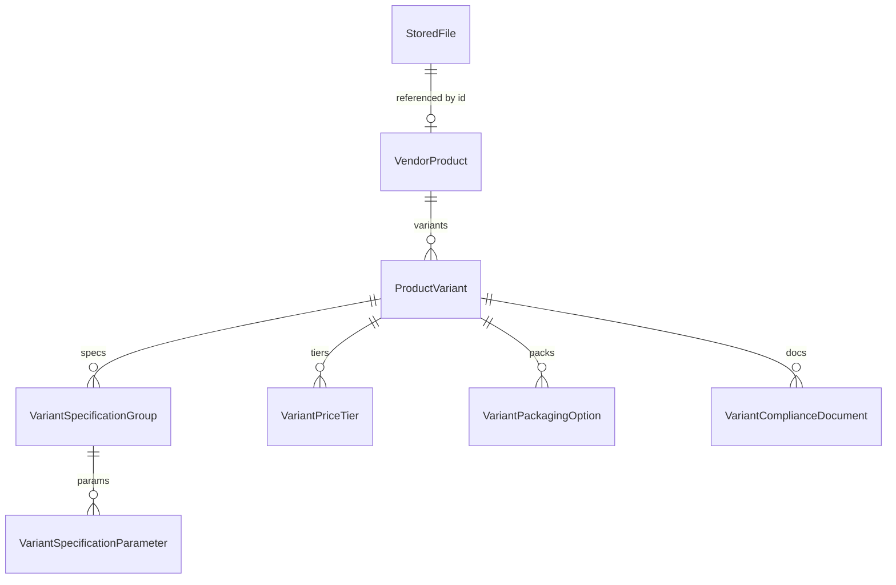
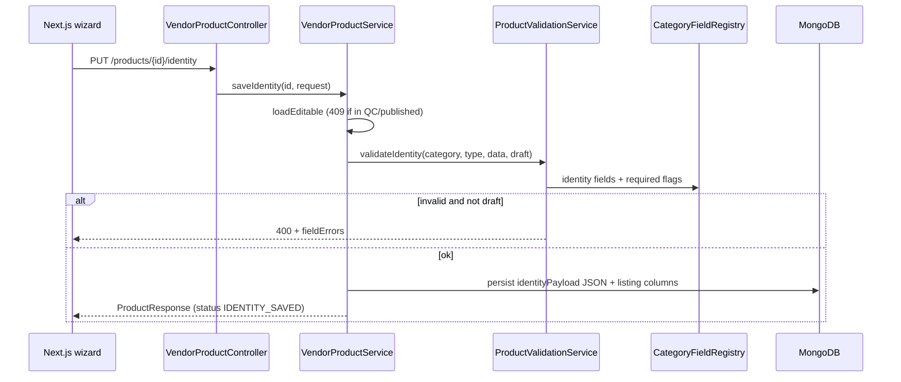

# Architecture — vendor-products-services

Spring Boot 3.3 / Java 21 REST backend for the Beetloop vendor portal’s **Products & Services** tab. It is a single deployable (`vendor-products-services` on port **8086**, context path `/vendor-products`) that the Next.js app talks to independently of the older products API on 8085.

---

## What it is

The service backs two vendor wizards:

- **List a Product** — five product categories, step-based and overall save, QC
- **List a Service** — five service categories, same pattern, plus documents

A third **project-management (PM)** package exists as Mongo documents and an ID generator, but it has **no REST controllers yet**.

JWT from `commons-security-library` is required. Vendor identity is the JWT `userId` (same pattern as be-leads-rfq). Spoofable `X-VENDOR-ID` / `X-USER-ID` / `X-QC-ROLE` headers are not used. OpenFeign talks to documents-store for uploads unless the `local-storage` profile is on.

---

## High-level shape



Classic layered layout:

**HTTP → Controller → Application service → Repository / Registry / File store**

Cross-cutting: CORS, OpenAPI, enum converters, a global error envelope.

---

## Package layout (bounded contexts)

| Package | Role |
|---|---|
| `controller`, `service`, `domain`, `dto`, `registry`, `repository` | **Products** — fully wired |
| `services.controller`, `services.service`, `services.domain`, `services.registry` | **Services** — same pattern as products |
| `pm.domain`, `pm.service`, `pm.repository` | **Project management** — domain only |
| `storage`, `documentstore` | Uploads — documents-store by default, local disk on `local-storage` |
| `config`, `exception` | Shared infrastructure |

Products and services are parallel bounded contexts that share error types, pagination, CORS, uploads, and the “JSON schema + relational core” idea. They do **not** share entities.

---

## Module 1 — Products (the core)

This is the most complete part of the app.

### Aggregate

`VendorProduct` is the aggregate root. One listing is one product plus many variants.



**Relational (stable, cross-category):**

- ownership (`vendorId`, `createdBy`)
- category, status, identity type, role id
- listing columns (`name`, `sku`, `originCountry`, …) used by `GET /products`
- variant details (name, grade, pack size, SKU, …)
- spec groups, price tiers, packaging options, compliance docs
- QC metadata (`qcReviewer`, `qcRemarks`, `submittedAt`)

**JSON columns (category-specific):**

- `identityPayload` — Step 1
- `rolePayload` — Step 2
- `detailsExtra` — variant fields that only some categories have
- `searchMarketplace` — Step 3.5
- `images` — list of file refs

That split is intentional. Identity fields range from ~24 to ~40 with almost no overlap across categories, and role fields change per role card. A table-per-type model would have meant dozens of tables and a migration per UI tweak.

### Wizard + QC state machine

```
DRAFT → IDENTITY_SAVED → ROLE_SAVED → VARIANTS_SAVED → SUBMITTED_FOR_QC
                                                             ↓
                                                      PENDING_REVIEW
                                                       ↓     ↓     ↓
                                                APPROVED  REJECTED  QUERY
                                                    ↓
                                                PUBLISHED
```

Each status also maps to a frontend `StatusKind` (`draft` / `qc-pending` / `query` / `published`) so catalog rows can render without translation.

Edits are blocked (`409`) while the product is in review, approved, or published. `REJECTED` and `QUERY` make it editable again.

### Two save modes

`VendorProductService` orchestrates both:

1. **Step-based** — each PUT/POST validates only that step. `draft: true` skips required-field checks so the vendor can leave and come back.
2. **Overall save** — identity + role + variants in **one transaction**. Omitted sections are left as-is. `submitForQc: true` can submit in the same call.

Submit runs a full-product validation, moves to `SUBMITTED_FOR_QC`, and generates a SKU if missing (first 3 letters of the first two words + `-001`).

QC decisions: `APPROVE` / `PUBLISH` / `REJECT` / `QUERY`. Reject/query require remarks.

### Schema-driven validation

`src/main/resources/category-schemas.json` is the executable field map, loaded at startup by `CategoryFieldRegistry`.

It answers: for this category / type card / role card, which fields exist, which are required, and what the error text is. Those names and messages match the Next.js wizard’s `validate()` blocks, so the frontend can do `setErrors(err.fieldErrors)` with no mapping.

`ProductValidationService` uses the registry to:

- reject unknown keys
- enforce required fields (unless `draft`)
- check option lists
- validate a complete product on submit

`GET /api/vendor/catalog/...` publishes the same schema, so the UI can render or cross-check forms from the API.

---

## Module 2 — Services (mirrors products)

Same architectural idea, different aggregate.

**Batch is the wizard run; items are catalog rows.**

- `VendorServiceBatch` — one “Add Service” session (category, status, batch-level stage JSON)
- `VendorService` — one listing inside that batch (listing columns + per-service stage JSON)
- `ServiceDocument` — accreditations / certifications / support docs

Categories: Lab Testing, Consultancy, Contract Manufacturer, Agro-Processing, CRO (11 stages; the others have 4).

Field sets are huge (~1,162 fields across categories), so almost everything lives in JSON (`stage_payloads` on batch and item), validated by `ServiceFieldRegistry` against `service-schemas.json`.

Submit is **conditional**: custom services from the “find” flow go to QC; others publish straight to the catalog. That matches the wizard’s “Publish to Catalog” vs “Submit for QC” button.

---

## Module 3 — Project management (domain only)

Under `pm/` there is a rich Mongo model aligned with a BRD:

- `PmProject` (business id `PRJ-YYYY-NNNN`, originating `rfqId`)
- orders, stages, tasks, checklist items, dependencies
- change orders, approvals, queries, issues
- shipments, delivery feedback, line items

`PmIdService` issues sequential IDs (`PRJ-2026-0001`, `ORD-…`, `TSK-…`) with a pessimistic lock and `REQUIRES_NEW` so concurrent creates cannot collide. Version suffixes (`-V1`) exist for rework.

There is **no PM controller**. This is persistence-ready domain work waiting for an API.

---

## Shared infrastructure

### HTTP surface

| Area | Base path |
|---|---|
| Products | `/api/vendor/products` |
| Product catalog schema | `/api/vendor/catalog` |
| Services | `/api/vendor/services` |
| Service catalog schema | `/api/vendor/services/catalog` |
| Uploads | `/api/vendor/uploads` |
| Swagger | `/swagger-ui.html` |

Controllers are thin. They bind DTOs, pass headers, and return mapped responses. Business rules live in the application services.

### Errors

`GlobalExceptionHandler` turns every failure into the same `ApiError` envelope:

```json
{
  "status": 400,
  "error": "Validation Failed",
  "message": "Product identity is incomplete",
  "fieldErrors": { "botanicalName": "Botanical Name is required" }
}
```

| Code | Meaning |
|---|---|
| 400 | validation / unknown field / unparseable body |
| 404 | unknown product, variant, or file |
| 409 | illegal status transition |
| 401 | missing or invalid JWT |
| 403 | authenticated but wrong role, or not the listing owner |

### CORS and frontend contract

`WebConfig` allows localhost and `https://*.beetloop.com`. Callers send `Authorization: Bearer`. `EnumConverterConfig` teaches Spring MVC to bind kebab-case ids (`raw-materials`, `qc-pending`) because MVC’s default enum converter does not use Jackson’s `@JsonCreator`.

### Auth and roles

`commons-security-library` validates HMAC JWTs. `@PreAuthorize` keeps the two BRD queues apart:

| Endpoints | Roles |
|---|---|
| Vendor listing CRUD, wizard saves, uploads | `VENDOR` |
| Product/service QC review + decisions | `QC_ADMIN`, `QC_USER` |
| `/intelligence/**` | `INTEL_QC`, `INTEL_ADMIN` |
| Live T1/T2 search, catalog schemas | `VENDOR` and both QC families |

Vendor mutations reject when `listing.vendorId != JWT userId`, unless the caller has a QC/Intel role.

### File uploads

`POST /api/vendor/uploads` keeps the same response shape (`id`, `fileName`, `url`). By default the service proxies to documents-store (`DOCUMENT_STORE_BASE_URL`) and the `id` is the Mongo document id. Profile `local-storage` (or `app.document-store.enabled=false`) writes to `./data/uploads` and the `stored_file` collection so Playwright can run without Azure. JWT is forwarded to documents-store.

### Persistence

Default: **MongoDB** database `ProductService` on the same replica set as `be-leads-rfq` (`SPRING_DATA_MONGODB_URI` / `SPRING_DATA_MONGODB_DATABASE`). Nested wizard children (variants, service items, documents) are embedded in the aggregate document. UUID ids are assigned on save. Catalogue SCC/CM codes use an atomic `counters` collection, same pattern as RFQ.

Unit tests run against embedded MongoDB (`test` profile) and do not use the shared cluster.

---

## Request flow (product Step 1)



Listing (`GET /products`) never unpacks JSON. Identity save denormalizes name, category, origin, and emoji onto columns so the catalog table is a simple query.

---

## Frontend integration

This backend is **additive**. The Next.js app uses a dedicated client (`vendorProductsServiceApi.ts`) pointed at:

```
NEXT_PUBLIC_VENDOR_PRODUCTS_API_BASE=http://localhost:8086/vendor-products
```

The older `/vendor/api/java/products/…` service on 8085 is untouched. If this backend is down, the wizard still works on local state.

---

## Design principles

1. **Schema as source of truth** — UI field names, required flags, and error text live in JSON, not in Java entities.
2. **Hybrid persistence** — relational where the shape is stable; JSON where it varies by category/card/stage.
3. **Wizard-first API** — step save, section save, overall save, and draft mode match how the UI actually works.
4. **Frontend-shaped responses** — status kinds, catalog rows, and `fieldErrors` drop straight into existing React state.
5. **Duplicate-the-pattern, don’t share the model** — services copy the products architecture rather than forcing one generic “listing” entity.
6. **Thin HTTP, fat application service** — state machine, validation, SKU generation, and listing denormalization sit in `VendorProductService` / `VendorServiceCatalogService`.

The PM package is the unfinished third context: data model and ID generation are in place; HTTP and application services are not.
